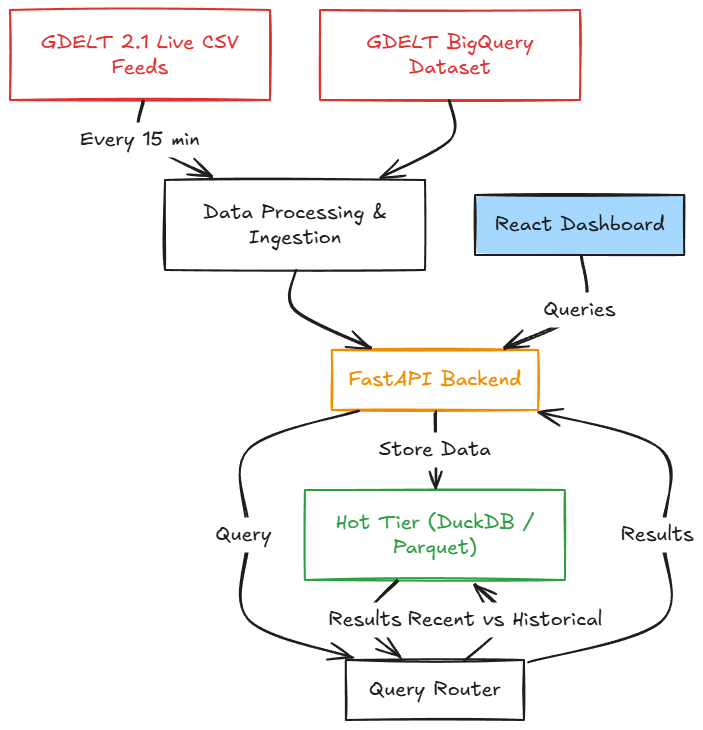
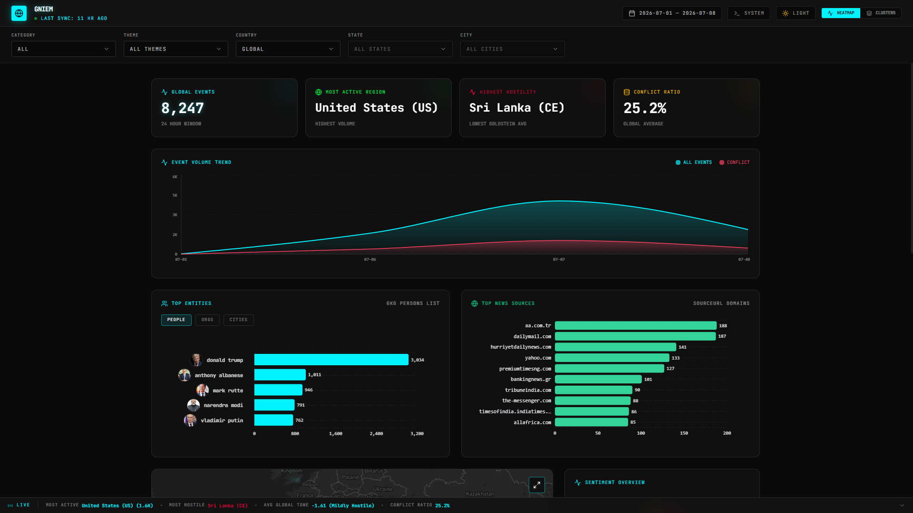
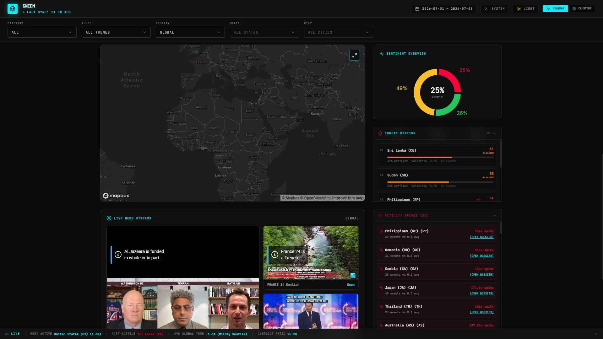
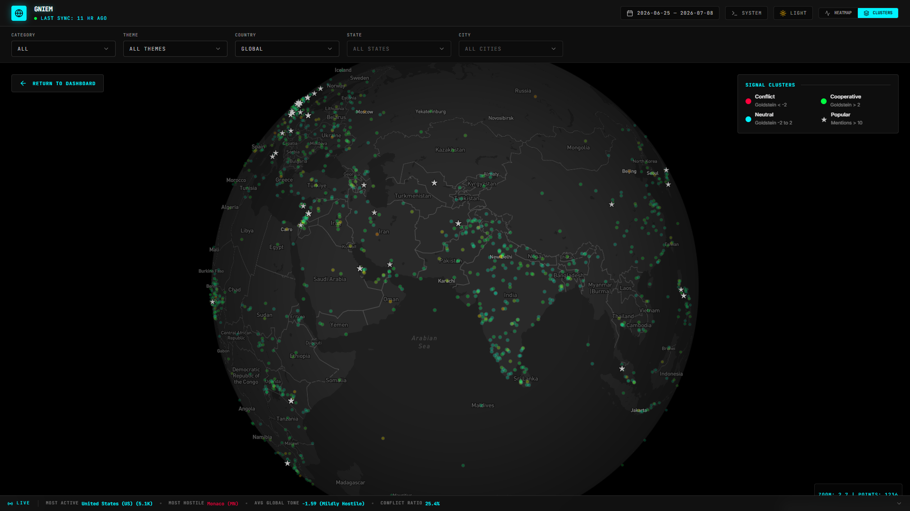
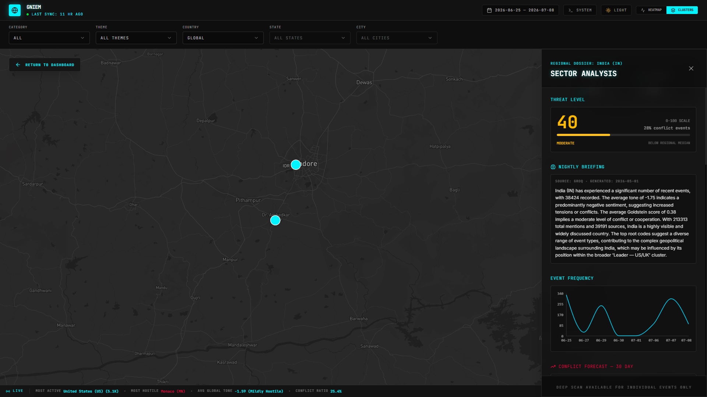
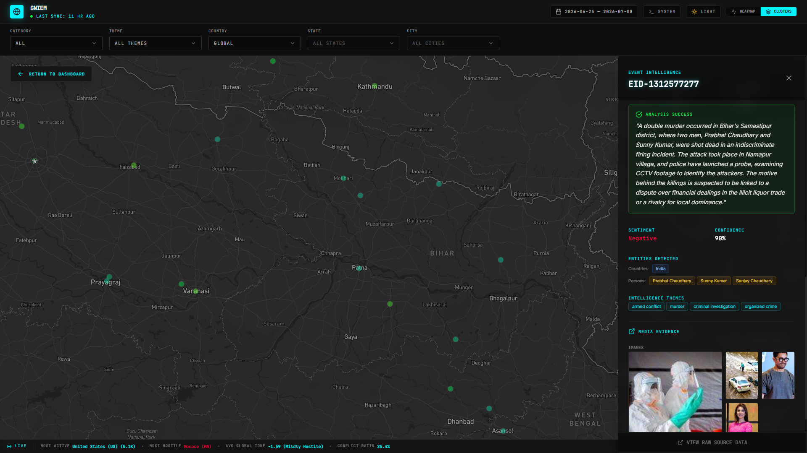

# GNIEM — Global News Intelligence & Event Monitoring System

GNIEM is a geopolitical intelligence dashboard and event-monitoring platform built on top of the GDELT 2.1 global database. The project implements a cost-optimized, hybrid OLAP architecture to serve analytical and predictive intelligence without the high infrastructure overhead typically associated with multi-terabyte datasets.

<p align="center">
    
</p>
---

## Architecture Design

### Hybrid OLAP Storage Engine
To address the traditional trade-offs between storage costs and analytical query performance, GNIEM partitions data into a dual-tiered architecture:
*   **Hot Tier (Recent 90 Days):** Incoming events are ingested through daily batch runs from BigQuery combined with 15-minute near-real-time streaming fetches. Data is stored on disk in structured Parquet files and queried concurrently on-the-fly using fresh in-process **DuckDB** memory connections to maintain low latencies.
*   **Cold Tier (Historical, >90 Days):** Historical events reside in **Google BigQuery**. Requests to this layer are governed by a routing engine that prioritizes cost minimization using dry-run estimations, partition pruning by `SQLDATE` integer values, and strict limits on scanned bytes per query.

### Machine Learning & Intelligence Pipeline
*   **Time-Series Forecasting:** Uses **Prophet** to execute nightly univariate forecasting on conflict-related event volumes, producing a 30-day "horizon" of projected regional activities.
*   **Anomaly Detection:** Leverages an unsupervised **IsolationForest** model to identify statistical anomalies and "Black Swan" events by evaluation of the joint distribution of event frequency, Average Tone, and NumMentions.
*   **Semantic Event Clustering:** Groups unstructured CAMEO events into high-level thematic clusters using **TF-IDF vectorization** and **K-Means clustering** (with auto-scaling bounds based on physical event counts).
*   **Generative Briefings:** Prompts **Llama 3 (via Groq)** nightly to summarize top active regions and synthesize multi-source news data into structured briefings.

---

## Visual Preview

### 1. Main Dashboard View
*A comprehensive bento-grid interface depicting key metrics, instability indexing, activity trends, and recent spike alerts.*
| --- | --- |
|  |  |
| --- | --- |

### 2. Interactive Map & Heatmap Shading
*High-fidelity Mapbox GL JS canvas rendering geographic concentration grids at low zoom, shifting to individual event detail markers on closer zoom levels.*


### 3. Deep Intelligence Sidebar & System Drawer
*Contextual analysis displaying Wikipedia-enriched entity mentions, live YouTube news streams, and system control variables.*
| --- | --- |
|  |  |
| --- | --- |


---

## Core Features

*   **Timeline Window Control:** Dynamic dual-handle range slider with native date picker integrations and pre-selected quick range options.
*   **Multi-Dimensional Filtering:** Deep drill-down options based on CAMEO event groupings (`CONFLICT`, `DIPLOMACY`, `COOPERATION`, `PRESSURE`) and target theme categories (`POLITICS`, `ECONOMY`, `HEALTH`, etc.).
*   **Wikipedia Entity Enrichment:** Resolves top parsed persons, organizations, and cities from GKG data, fetching Wikipedia thumbnail previews dynamically.
*   **Geocoded Boundary Filtering:** Offline reverse-geocoding coordinates mapping (`latitude`, `longitude`) to precise administrative regions (`Country`, `State`, `City`) within DuckDB query definitions.
*   **On-Demand Scraper & LLM Deep Dive:** Intercepts source URLs utilizing **Jina AI Reader**, extracting article text for structured LLM parsing (returning summaries, entities, sentiment, confidence scoring, and inline media arrays).
*   **Theme Adaptation:** Multi-mode theme (Dark/Light) built natively via CSS variables and theme-responsive charts.

---

## Technical Stack

| Component | Technology | Description |
| :--- | :--- | :--- |
| **Frontend Framework** | React 19 + TypeScript + Vite | Clean single-page user interface |
| **State Management** | Zustand | Global storefront state with decoupled persistence |
| **Visualization** | Mapbox GL JS + Recharts | Responsive maps and interactive chart components |
| **Styling** | Tailwind CSS v4 | Declarative design token implementation |
| **API Framework** | FastAPI | Async Python runtime with automatic OpenAPI docs |
| **Parsing & Schema** | Pydantic v2 | Robust object mapping and request validation |
| **OLAP Engine** | DuckDB (v1.0+) | Highly performant in-process parquet query executor |
| **Data Warehouse** | Google BigQuery | Scalable historical data storage tier |
| **Scheduler Engine** | Supercronic | Lightweight container-friendly cron manager |

---

## BigQuery Safety Rules

This system implements explicit restrictions to keep cloud compute footprints within minimal resource limits:
1.  **Strict Column Pruning:** The backend never runs `SELECT *` patterns against BigQuery. Query blocks must target explicit columns.
2.  **Partition Enforcement:** Every cold-tier call must include an integer-based partition filter matching `SQLDATE` parameters (e.g. `YYYYMMDD`).
3.  **Dry-Run Validation:** Before any statement is dispatched, the database wrapper performs a mock execution (`dry_run=True`) to assert that `total_bytes_processed < BQ_MAX_SCAN_BYTES` (default 2GB threshold).

---

## Getting Started

### Prerequisites
*   [Docker](https://www.docker.com/) and Docker Compose installed.
*   A Google Cloud Platform project with the BigQuery API enabled, and a Service Account key file.
*   A [Groq API Key](https://wow.groq.com/) (required for LLM components).
*   A [Mapbox Access Token](https://docs.mapbox.com/help/getting-started/access-tokens/) (required for map canvas rendering).

### 1. Configuration
Copy `.env.example` to `.env` in the root of the project and supply your active variables:

```bash
cp .env.example .env
```

Review and adjust variables:
```env
# GCP / BigQuery Credentials
GCP_PROJECT_ID=your-gcp-project-id
GOOGLE_APPLICATION_CREDENTIALS=/path/to/your/service-account-key.json

# API Credentials
GROQ_API_KEY=gsk_...
VITE_MAPBOX_ACCESS_TOKEN=pk.eyJ1...

# Storage Thresholds
HOT_TIER_CUTOFF_DAYS=90
COLD_TIER_MAX_WINDOW_DAYS=30
```

### 2. Ingestion & Initial Data Setup
Before launching the service, you will need to populate local Parquet files for the DuckDB hot tier. Ensure your Google Application Credentials are valid and map to the `.env` configuration, then execute:

```bash
# Pull 7 days of historical GDELT data to establish a baseline
python scripts/daily_bq_pull.py --backfill-days 7 --parallel --workers 3
```

This will output Parquet files inside `./data/hot_tier/` partitioned by date (e.g., `events_YYYYMMDD.parquet`).

### 3. Launching with Docker Compose
To build and deploy the complete stack (FastAPI Backend, Nginx-delivered Web Frontend, and Cron Scheduler):

```bash
docker-compose up --build -d
```

### 4. Direct Development Setup (Local)
If you prefer running services directly on your host environment:

#### Backend
```bash
cd backend
python -m venv .venv
source .venv/bin/activate  # On Windows: .venv\Scripts\activate
pip install -r requirements.txt
export PYTHONPATH=.
uvicorn backend.api.main:app --reload --port 8000
```

#### Frontend
```bash
cd frontend
npm install
npm run dev
```

---

## Scheduler Operations

The platform uses a cron scheduler container to keep the local Hot Tier in sync with the primary GDELT feeds:

*   **Near-Real-Time Stream Ingestion (`*/15 * * * *`):** Triggers `realtime_fetcher.py` every 15 minutes, fetching live events, mentions, and GKG listings, cleaning them, and updating the local buffer (`realtime_buffer.parquet`).
*   **Daily Consolidated Pull (`0 2 * * *`):** Triggers `daily_bq_pull.py` at 02:00 UTC to execute structured server-side BigQuery operations for the previous day, generating a finalized `events_YYYYMMDD.parquet` file and flushing the buffer.
*   **Nightly AI Computing Pipeline (`0 3 * * *`):** Triggers anomaly detection runs and synthesizes geopolitical briefings for cached retrieval.

---

## Disclaimer & Limitations
*   **GDELT Data Taxonomy:** GDELT classifies events via the actor-action CAMEO coding taxonomy. Because of this, certain topical filters (e.g., `SPORTS`, `TECH`, `HEALTH`) map to approximate interaction codes and may yield lower-precision results than strictly defined geopolitical conflict events.
*   **English-Language Focus:** GDELT metrics (such as `most_active_country`) frequently indicate a heavy concentration in the United States and associated regions due to the dominant language patterns of monitored news sources.
